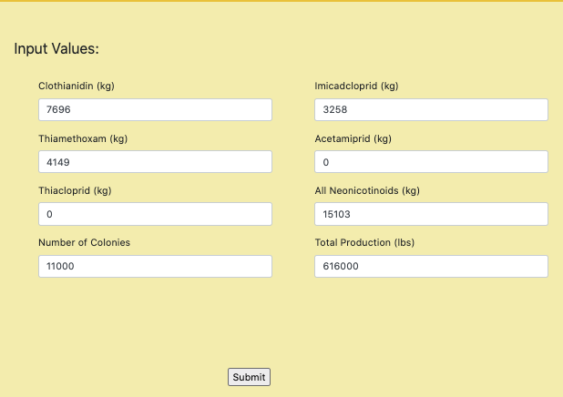

## Better Than a “B”ee Project

**Project Members: Graham Endean, John Falcone, Yukie Kajita, Katy Luquire, Brian Stronger, & Jessica Yoder**

 
* Beginning in 2006 with the first reported case of Colony Collapse Disorder (CCD), honeybee hives across the world (and for this project the USA) have been disappearing at an alarming rate. With no end in sight to the loss of our favorite pollinators, cause apparently nobody learned anything from the Bee movie, once again data must come to the rescue! We have devised two machine learning tasks to aid our fellow bee enthusiasts and researchers in understanding CCD as well as some trends to point to so it can be prevented in the future.

#### Main Homepage Image

* By taking in data from various sources (Data.world, Kaggle.com, USDA etc.), we have compiled information on various metrics for honey production and honeybee health ranging from 1989 to 2019.  Visualizations are mostly on more recent years due to the abundance of data available since the first reported case of CCD. Each visualization was created using tableau with different ranges of interactivity in each, some can display different year data dynamically throughout a selected time range while others are separated by state and region to display individual metrics on production.

* The team has created two machine learning tasks to assist in studying CCD! First, we have a model that will take in different metrics of pesticide usage to predict if their continued implementation would hinder honey production or honey production value in a significant way. For honey production model, we used honeybee colony number and all neonicotinoid data as x variables. For the production value model, we used honeybee colony number, total honey production, and all neonicotinoid data as x variables. X and y variables were preprocessed with a standard scaler. We used sklearn.liner_model with linear regression, Lasso, Ridge, and ElasticNet models for the machine learning process, and compared the MSE and r2 values. Because we obtained similar MSE and pretty high r2 values from all models, we decided to use all models to predict the y variables. We saved x and y scalers' and all machine learning models, and used those files to create a data prediction website with flask app.

 * #### Honey Prediction Webpage - Data Input Example
 

 * #### Predicted Values through Machine Learning Models
 

* Second, we have an image recognition model that can take in a user uploaded image and separate it into four categories (Bee, Wasp, Insect, or other). The initial upload of the model has it at an almost 95% accuracy rate! Keep in mind however the model is only able to identify things close to the initial uploaded images for the model therefore it might classify some images incorrectly in the insect or other categories.

  * #### Image Recognition Webpage
 File Selection and Prediction Example with a Ladybeetle Image File.
 

* We created a website with main, image recognition, honey machine learning, documentation & references, visualizations, and contact pages. Our website was deployed with Heroku. 

 https://bee-model.herokuapp.com/

 Enjoy our website!
